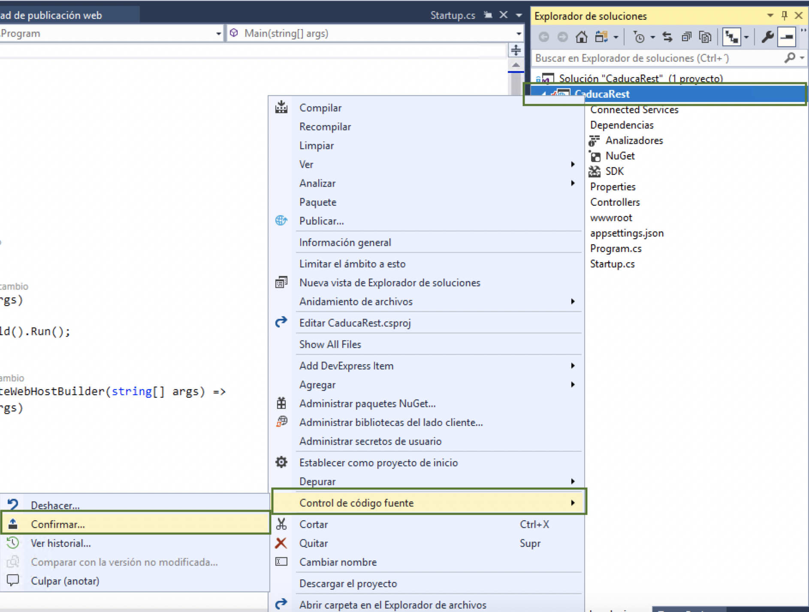
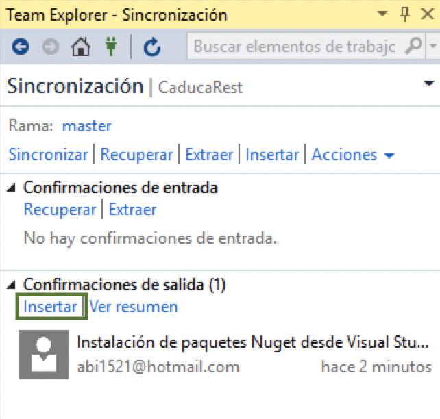

### Sincronicacion

- incronizar los cambios del código con GitHub y Visual Studio

Una vez que instalaste los paquetes nuget puedes sincronizar tus cambios con el servidor de GitHub para que esté disponible para los demás.

En visual studio se agrega una palomita de color rojo al lado del archivo para indicar cuales archivos han sido cambiados y aún no han sido sincronizados con el servidor.

### Sincronizar  desde Visual Studio

1. Dar clic derecho sobre el proyecto. Luego en la opción Control de Código Fuente -> Confirmar



2. Al lado derecho te muestra una ventana en la cual puedes escribir la descripción del cambio, y te muestra los archivos que han cambiado. Tecleamos como descripción: Instalación de paquetes Nuget desde Visual Studio Comunity luego damos clic en Confirmar Todo 


3. De esta forma los cambios están solamente en tu computadora. Para publicarlos en github da clic en Sincronizar


4. Damos clic en Insertar




---

### Visual Studio Code

1. Cree un directorio donde se guardarán los repositorios


)

2. Abra el directorio en Visual Studio Code (menú Archivo > Abrir carpeta ...):


3. Para clonar el repositorio necesitará dos rutas (el origen y el destino):

- La URL de repositorio, que se puede copiar desde el propio repositorio haciendo clic en el botón "Clone or download".

- Esta URL es la misma URL que aparece en el navegador pero terminada en .git.

- En la captura de ejemplo, la URL de origen es https://github.com/NumaNigerio/test-01.git


La ruta del directorio de destino, es decir, la ruta de la carpeta en la que se va a crear la carpeta que contendrá la copia del repositorio. Esta ruta se puede copiar del Explorador de Windows.

En la captura de ejemplo, el directorio de destino es C:\Users\Barto\Documents\LMSGI\Barto\Repositorios


4. En Visual Studio abra la ventana de comandos con Ctrl+May+p


5. Escriba el comando git:clone y pulse Intro:


6.Escriba la URL del repositorio de origen y pulse Intro:


7. Escriba la ruta del directorio que contendrá la copia y pulse Intro:


8. En unos segundos se mostrará la carpeta del repositorio clonado en la barra del explorador y se ofrecerá la posibilidad de abrir la carpeta del repositorio clonado. Haga clic en "Abrir repositorio"


9. Visual Studio Code abrirá la carpeta del repositorio clonado, mostrando su contenido (en el ejemplo, el repositorio contiene únicamente el fichero README.md.


### Realizar commits en el repositorio remoto

En git, un commit es un conjunto de cambios que se realizan en los ficheros del repositorio.

En Visual Studio Code podemos realizar commits, que se guardan en el repositorio local. Para sincronizar nuestros cambios en el repositorio, debemos identificarnos como usuario del repositorio.

El proceso en Visual Studio Code sería el siguiente:

Abra una ventana de Terminal e indique a git la dirección de correo del usuario (la dirección de correo vinculada a su cuenta en GitHub):

```powershell
git config --global user.email SU-CORREO-ELECTRONICO
```


